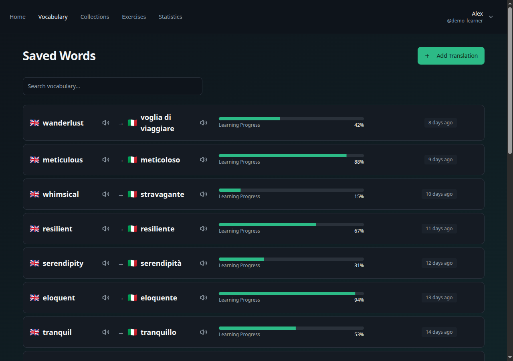
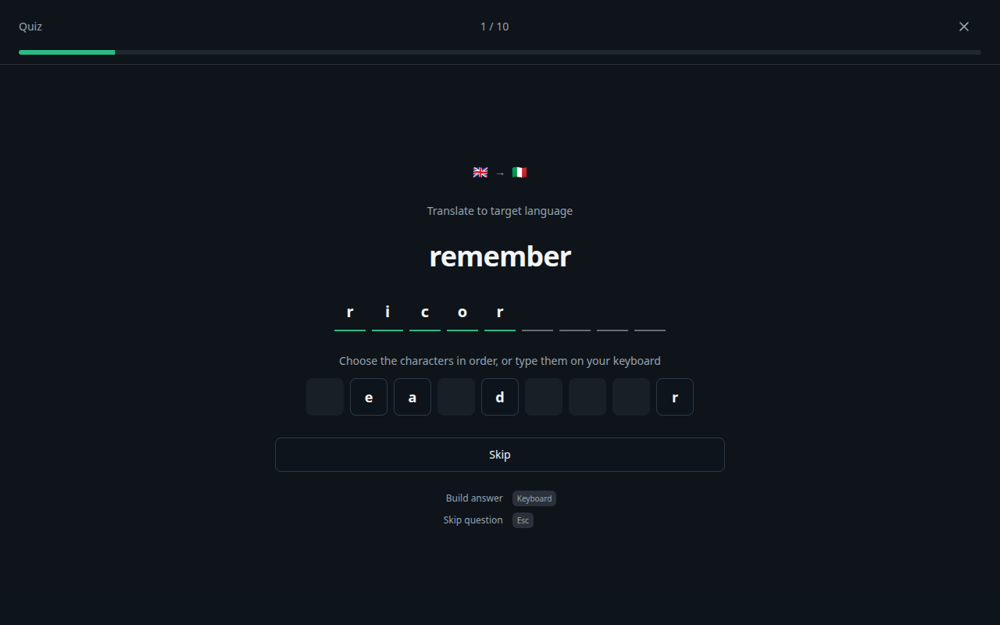
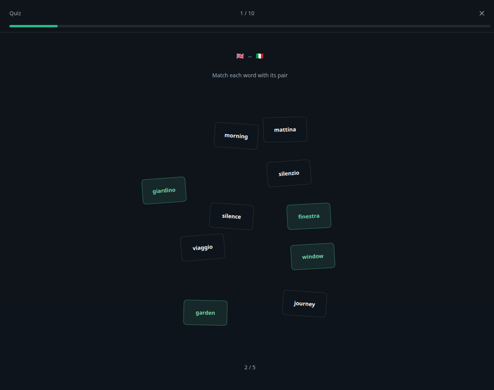
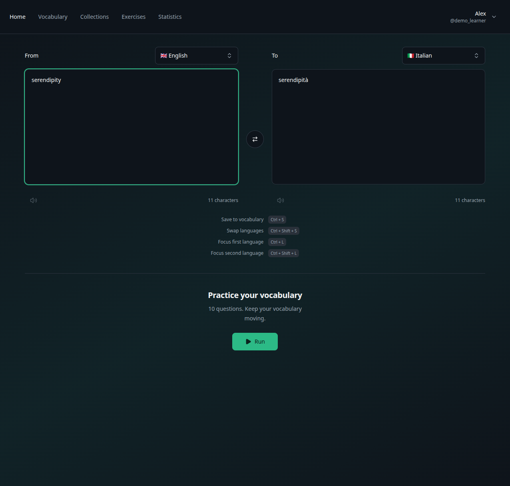
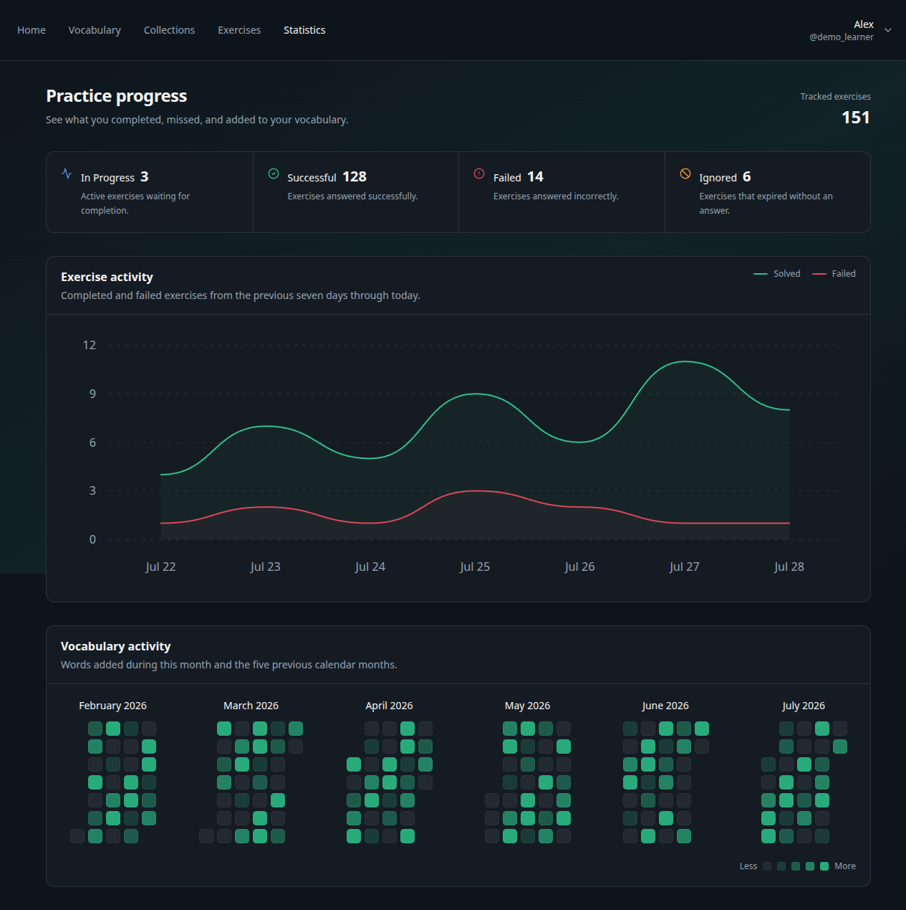
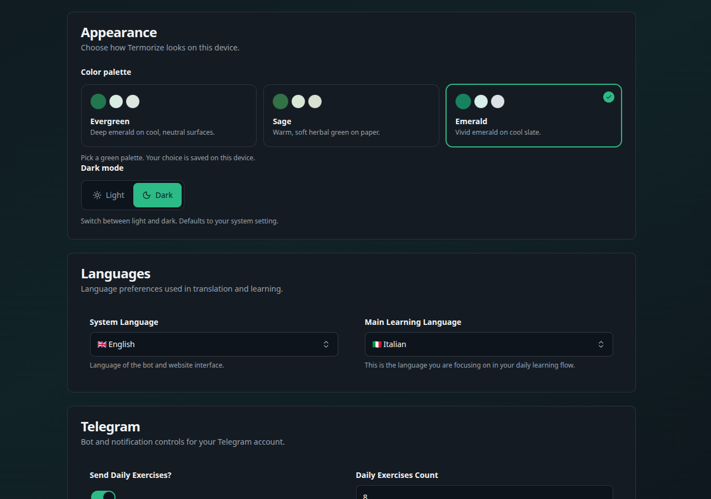

# Termorize

A vocabulary trainer for the web and Telegram. Translate, save, practice, and track your progress across devices.

**Bot:** [@termorize_bot](https://t.me/termorize_bot)  
**Website:** [termorize.daniil.online](https://termorize.daniil.online)

---

## Features

- **Personal vocabulary** — Save, search, and track mastery for every word pair.
- **Instant translation** — Translate across ten languages and save results in one click.
- **Smart exercises** — Practice with typed, multiple-choice, character, and matching quizzes.
- **Progress tracking** — Review exercise history, mastery changes, and activity charts.
- **Collections** — Build, reorder, filter, and share themed word sets.
- **Telegram bot** — Schedule synced daily exercises by count, timezone, and active hours.
- **Custom appearance** — Choose three green palettes, light or dark mode, and app languages.
- **Browser extension** — Translate selected text on ordinary web pages with `Alt+T`, then edit or save it. A context-menu fallback handles embedded cross-origin frames. On Google Translate, save the current pair with `Ctrl+S` or review it first with `Ctrl+E`. See [installation instructions](browser-extension/README.md).

## Screenshots

### Exercises

<table>
  <tr>
    <td width="50%">
      
    </td>
    <td width="50%">
      
    </td>
  </tr>
  <tr>
    <td align="center">Character exercise</td>
    <td align="center">Matching exercise</td>
  </tr>
</table>

### Translation

### Statistics

### Settings

